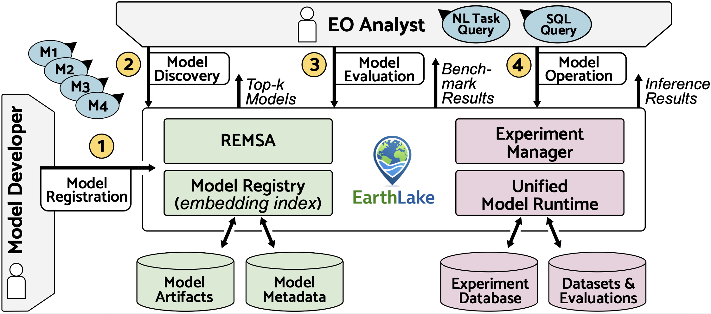
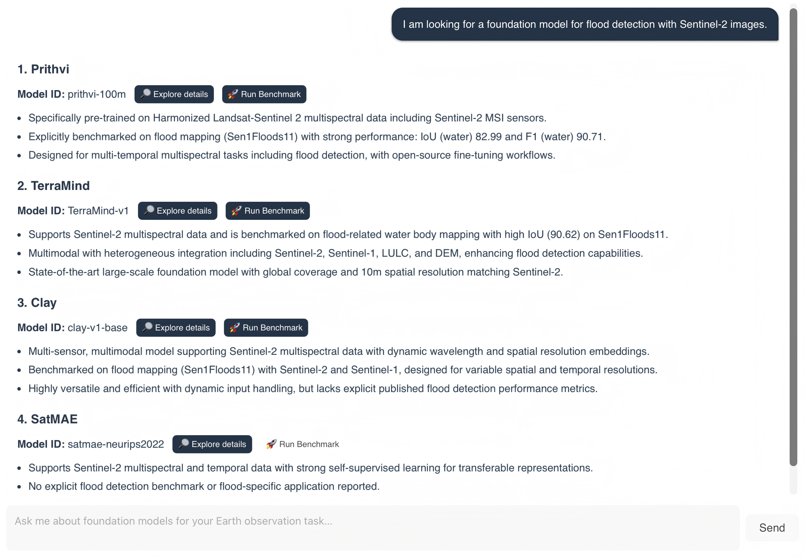
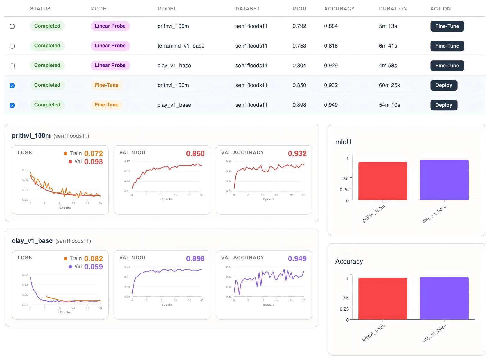

# EarthLake: Model Management for Earth Observation Foundation Models

## Overview

EarthLake is a model lake system for Earth Observation (EO) foundation models.  
It enables **model discovery, evaluation, and operation** in a unified workflow.

## Features

- 🔎 **Model Discovery** via natural language (REMSA)
- 📊 **Benchmarking & Evaluating** of EO models
- 🚀 **Operation & Inference** on new imagery
- 🗂️ **Model Registry** with structured metadata

### Architecture
<p align="center">
    
</p>

### REMSA Chat Tool
<p align="center">
  
</p>

### Benchmarking
<p align="center">
  
</p>


## Getting Started
1. run ```cp .env.example .env```
2. Set your OpenAI Api Key in .env
3. Run setup with correct profile ( 'gpu' for cuda, else 'cpu', including mps )
2. ```docker compose --profile cpu up```
3. go to http://localhost:5173

## Acknowledgments
The original implementation of REMSA: [https://github.com/be-chen/REMSA.git](https://github.com/be-chen/REMSA.git)
