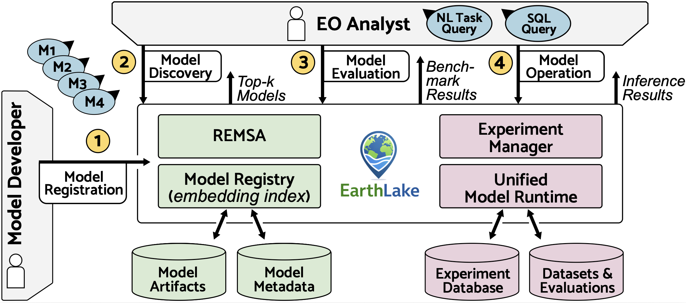
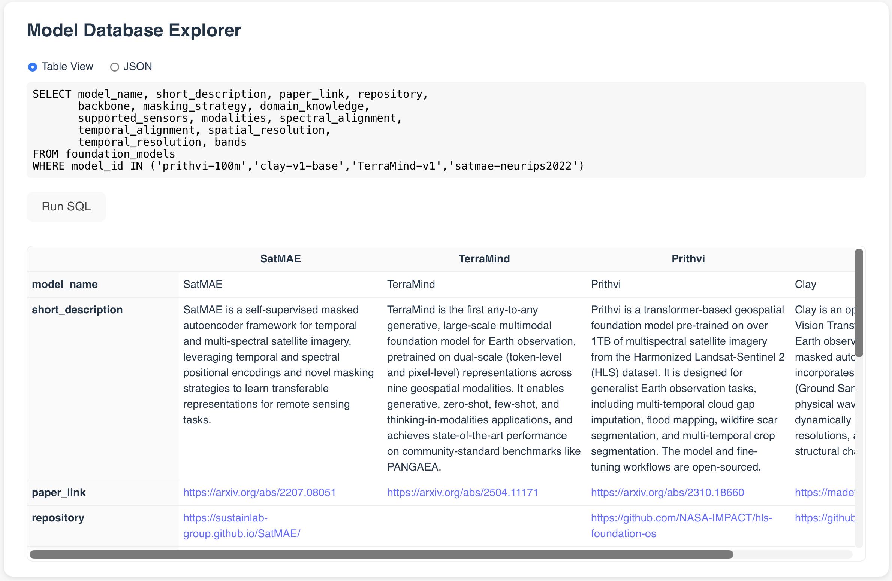
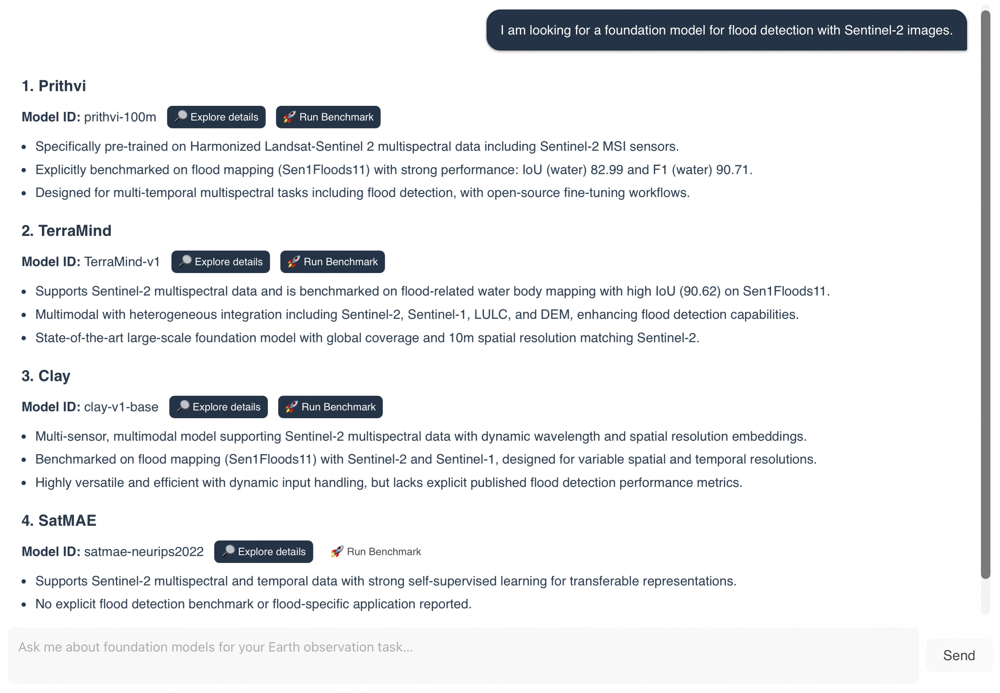
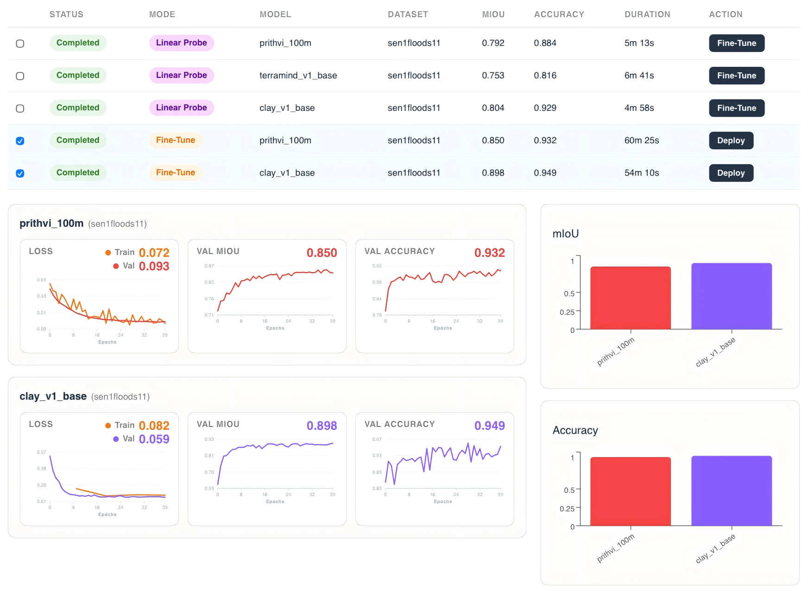
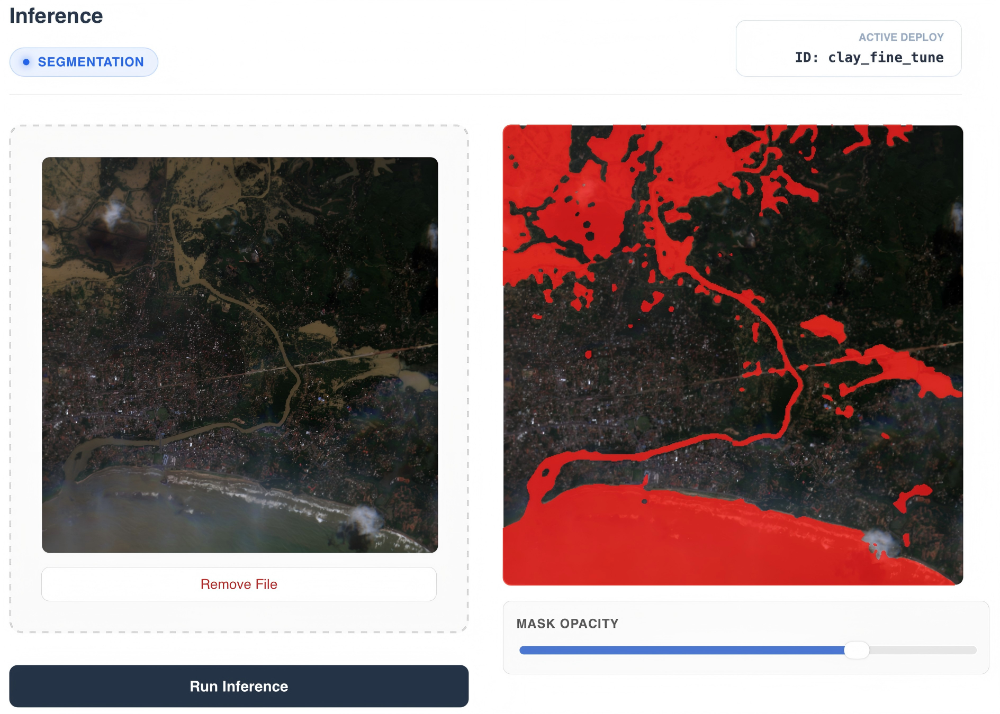

# EarthLake: Model Lake System for Earth Observation Foundation Model Management

<p align="center">
    
</p>

This repository contains the code of the paper [**Demonstrating EarthLake: A Model Lake System for Earth Observation Foundation Model Management**](Paper.pdf). The work introduces EarthLake, a model lake system for Earth Observation Foundation Models (EO FMs), enabling users to discover, evaluate, compare, and operationalize EO FMs in a unified workflow.

This work has been done at [BIFOLD](https://www.bifold.berlin/) and [TU Berlin](https://www.tu.berlin/) by Binger Chen, Haralampos Gavriilidis, Luca Gaedicke, Tacettin Emre Bök, Matthias Boehm, Ziawasch Abedjan, Begüm Demir, and Volker Markl.

If you use this code, please cite our paper given below:

> B. Chen, H. Gavriilidis, L. Gaedicke, T. E. Bök, M. Boehm, Z. Abedjan, B. Demir, V. Markl, "Demonstrating EarthLake: A Model Lake System for Earth Observation Foundation Model Management", PVLDB demonstration paper, 2026.

```bibtex
@misc{chen2026earthlake,
      title={Demonstrating EarthLake: A Model Lake System for Earth Observation Foundation Model Management},
      author={Binger Chen and Haralampos Gavriilidis and Luca Gaedicke and Tacettin Emre Bök and Matthias Boehm and Ziawasch Abedjan and Begüm Demir and Volker Markl},
      year={2026},
      note={PVLDB demonstration paper},
      url={https://github.com/polydbms/earthlake/},
}
```

---

## Overview

**EarthLake** supports end-to-end management of Earth Observation Foundation Models by combining:

- A schema-guided model registry for EO FMs
- Natural-language and SQL-based model discovery
- Integration with REMSA for task-driven model recommendation
- Reproducible benchmarking and model comparison
- Operational inference on new EO imagery

The system enables EO analysts and model developers to manage heterogeneous foundation models, metadata, benchmark configurations, evaluation results, and model artifacts within a unified model lake.

---

## Environment Setup

This project uses Docker Compose for containerized setup.

Create the environment configuration file:

```bash
cp .env.example .env
```

Set your OpenAI API key in the `.env` file.

---

## Configuration

EarthLake is configured through the project environment and Docker Compose setup. The following parameters can be adjusted:

- OpenAI API key
- Runtime profile selection
- Backend and frontend service configuration
- Model registry and metadata paths
- Benchmarking and inference runtime settings

Adjust these parameters according to your local runtime environment and available hardware.

---

## Running EarthLake

Run EarthLake with the correct profile. Use `gpu` for CUDA-enabled environments, and `cpu` otherwise, including CPU and MPS-based setups:

```bash
docker compose --profile cpu up
```

For GPU environments:

```bash
docker compose --profile gpu up
```

After startup, open the web interface at:

```bash
http://localhost:5173
```

---

## 🗂️ Model Registration

EarthLake allows model developers to register new EO foundation models into the model lake.

Model documentation, such as research papers or model cards, can be used to extract structured metadata fields, including:

- Supported EO tasks
- Input data modalities
- Architecture information
- Training details
- Runtime and hardware constraints

The extracted metadata populates the model registry and makes each model searchable and comparable within EarthLake.

<p align="center">
  
</p>

---

## 🔎 Model Discovery

EarthLake supports model discovery through both structured and natural-language interfaces.

Users can search the model lake using:

- SQL queries over the structured model registry
- Natural-language task descriptions
- Operational constraints such as modality, hardware availability, and target task

EarthLake integrates REMSA as its discovery module to retrieve and rank candidate EO FMs. The system returns a top-k list of recommended models together with metadata and explanations for their task compatibility.

<p align="center">
  
</p>

The original implementation of REMSA is available at:

[https://github.com/be-chen/REMSA.git](https://github.com/be-chen/REMSA.git)

---

## 📊 Benchmarking and Evaluation

EarthLake enables users to benchmark candidate models on their own EO datasets:

<p align="center">
  
</p>

The benchmarking workflow supports:

- Model selection from discovery results
- Dataset upload
- Evaluation configuration
- Linear probing
- Fine-tuning
- Performance comparison across candidate models

---

## 🚀 Model Operation

After evaluation, users can operationalize the selected model directly within EarthLake.

EarthLake loads the validated model configuration and executes inference through a unified runtime interface. Users can upload new satellite imagery and run EO tasks such as classification or segmentation, with prediction results shown in the interface.

This connects model discovery, benchmarking, and deployment in a single workflow.

<p align="center">
  
</p>

---

##  Corresponding Author

**Binger Chen**
https://hu.berlin/binger_chen

For questions, requests and concerns, please contact [Binger Chen](mailto:binger.chen@hu-berlin.de).

## License

The code in this repository is licensed under the terms specified in the `LICENSE` file.
